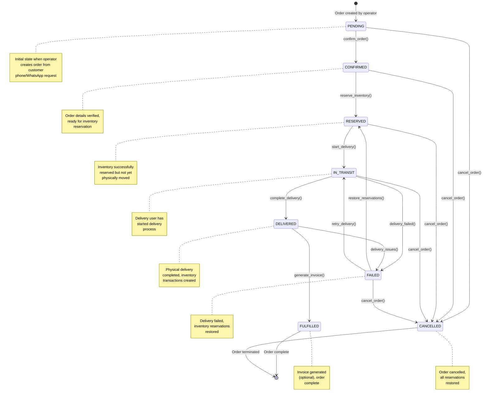
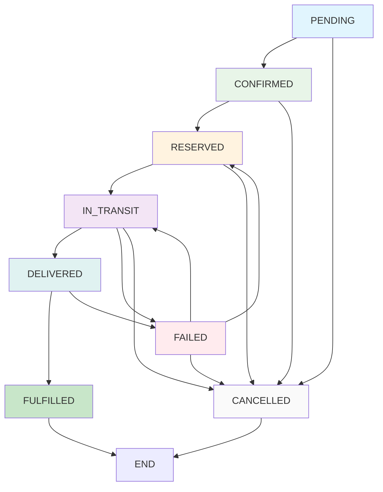
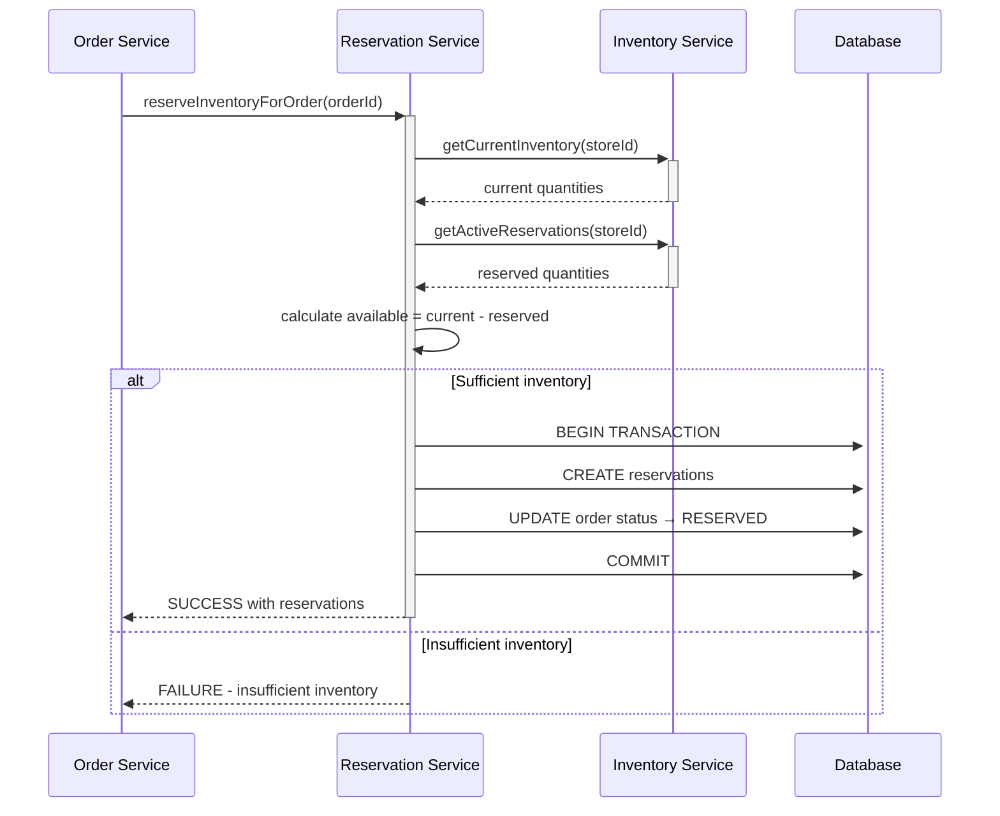
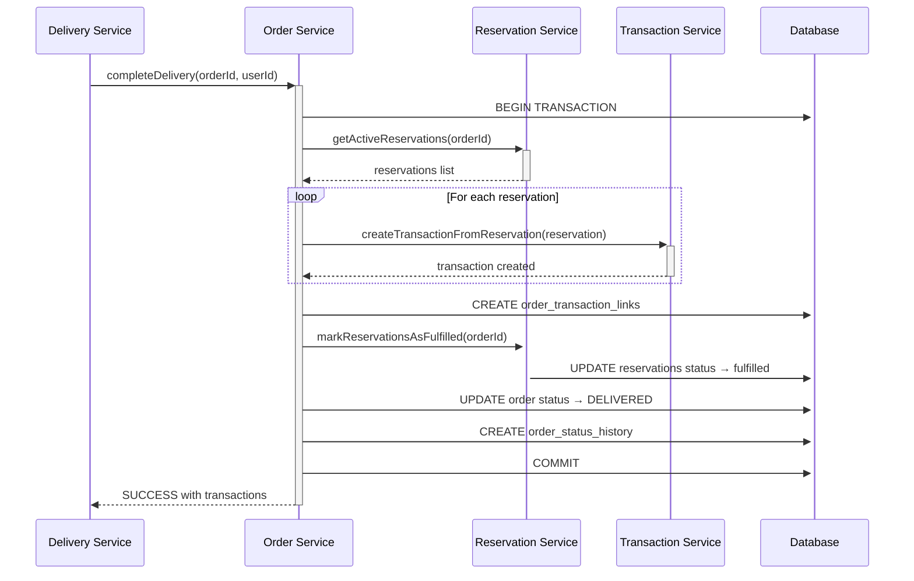
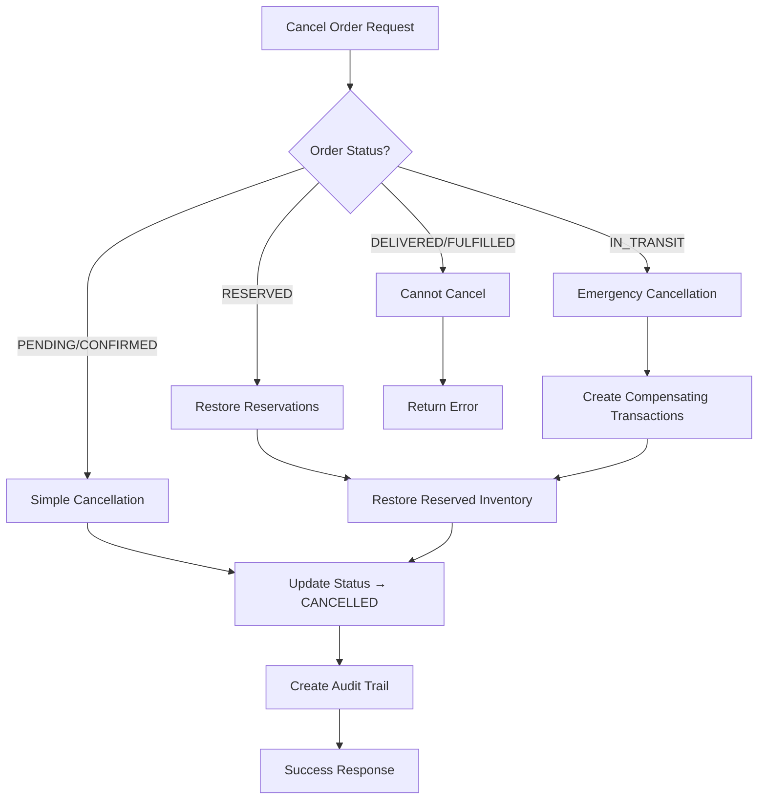
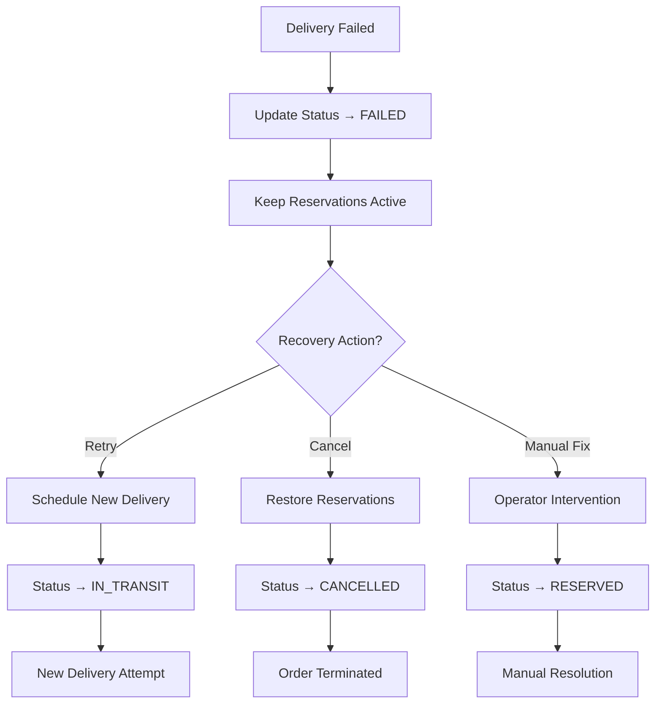

# LPG Order Management - Workflow State Machine

## Order Status Flow Diagram

## Detailed State Transition Rules

### State Descriptions

| Status | Description | Business Rules |
|--------|-------------|----------------|
| **PENDING** | Order created by operator | - Initial state - Can be edited - No inventory impact |
| **CONFIRMED** | Order details verified | - Customer info validated - Items confirmed available - Ready for reservation |
| **RESERVED** | Inventory reserved | - Inventory quantities reserved - Available = Current - Reserved - Physical inventory unchanged |
| **IN_TRANSIT** | Delivery started | - Delivery user assigned - Reservations remain active - Delivery tracking active |
| **DELIVERED** | Physical delivery done | - Inventory transactions created - Reservations converted to transactions - Customer confirmation |
| **FULFILLED** | Order complete | - Invoice generated (optional) - All processes complete - Final state |
| **FAILED** | Delivery failed | - Inventory reservations restored - Available for retry - Requires attention |
| **CANCELLED** | Order terminated | - All reservations restored - No inventory impact - Audit trail maintained |

### Valid Transitions

## Business Logic Integration

### Inventory Reservation System

### Delivery Completion Flow

## Error Handling Patterns

### Cancellation Recovery

### Failed Delivery Recovery

## API Operation Mapping

| HTTP Method | Endpoint | State Transition | Business Operation |
|-------------|----------|------------------|-------------------|
| POST | `/v1/orders` | → PENDING | Create order |
| POST | `/v1/orders/:id/confirm` | PENDING → CONFIRMED | Validate order |
| POST | `/v1/orders/:id/reserve` | CONFIRMED → RESERVED | Reserve inventory |
| POST | `/v1/orders/:id/start-delivery` | RESERVED → IN_TRANSIT | Begin delivery |
| POST | `/v1/orders/:id/complete-delivery` | IN_TRANSIT → DELIVERED | Complete delivery |
| POST | `/v1/orders/:id/generate-invoice` | DELIVERED → FULFILLED | Generate invoice |
| POST | `/v1/orders/:id/fail-delivery` | IN_TRANSIT → FAILED | Handle failure |
| DELETE | `/v1/orders/:id` | Any → CANCELLED | Cancel order |

This workflow ensures complete order lifecycle management with proper inventory integration and comprehensive error handling.