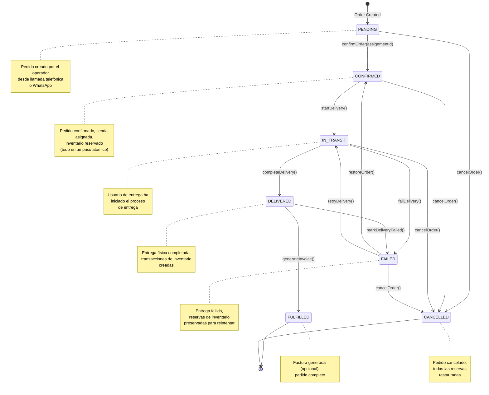
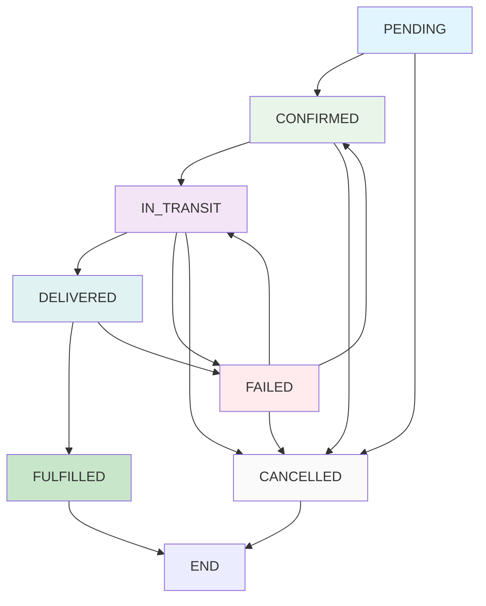
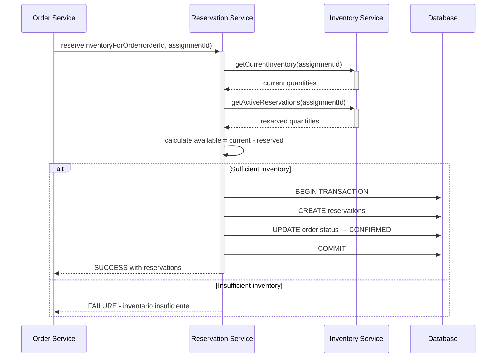
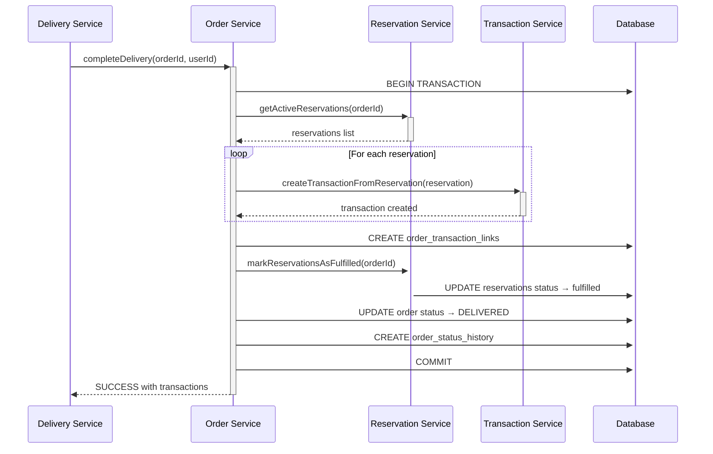
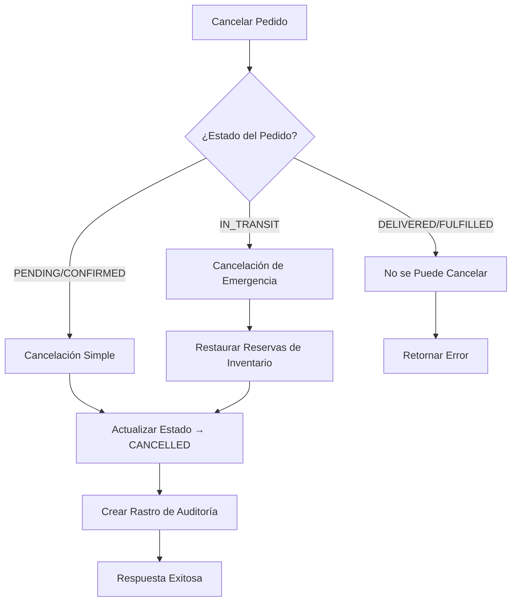
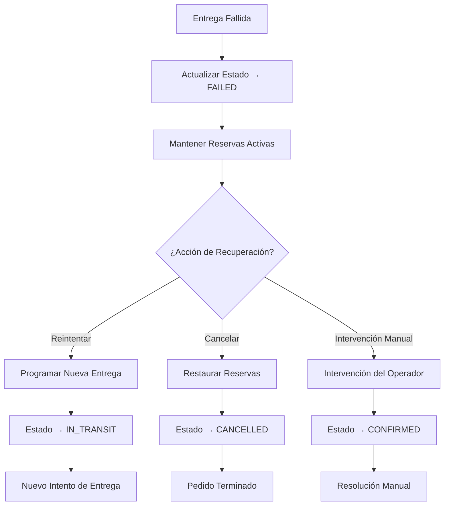

# Orders Module - Workflow & UX Design

## 🎯 **Overview**

This document consolidates the workflow state machine, UX design specifications, and user interface flows for the Orders module. The implementation features a **simplified 2-step workflow** with comprehensive Spanish localization and operator-focused design patterns.

## 🔄 **Simplified Workflow State Machine**

### **Production State Diagram** ✅



### **State Transition Rules** ✅

#### **State Descriptions with Spanish Context**

| Status | Spanish Description | Business Rules |
|--------|-------------------|----------------|
| **PENDING** | Pedido creado, esperando confirmación | - Estado inicial<br>- Puede ser editado<br>- Sin impacto en inventario |
| **CONFIRMED** | Pedido confirmado, tienda asignada, inventario reservado | - Información del cliente validada<br>- Artículos confirmados disponibles<br>- Inventario reservado automáticamente |
| **IN_TRANSIT** | Pedido en camino para entrega | - Usuario de entrega asignado<br>- Reservas permanecen activas<br>- Seguimiento de entrega activo |
| **DELIVERED** | Pedido entregado exitosamente | - Transacciones de inventario creadas<br>- Reservas convertidas a transacciones<br>- Confirmación del cliente |
| **FULFILLED** | Pedido completo, factura generada | - Factura generada (opcional)<br>- Todos los procesos completos<br>- Estado final |
| **FAILED** | Entrega fallida, requiere atención | - Reservas de inventario preservadas<br>- Disponible para reintento<br>- Requiere atención del operador |
| **CANCELLED** | Pedido cancelado | - Todas las reservas restauradas<br>- Sin impacto en inventario<br>- Rastro de auditoría mantenido |

### **Valid State Transitions** ✅



#### **Key Simplifications from Original Design**

- ❌ **REMOVED**: Separate `RESERVED` status - now integrated into `CONFIRMED`
- ✅ **ATOMIC**: Store assignment + inventory reservation happen in single operation
- ✅ **DIRECT**: `CONFIRMED` transitions directly to `IN_TRANSIT`
- ✅ **RECOVERY**: `FAILED` orders can be restored to `CONFIRMED` or retried as `IN_TRANSIT`

## 📞 **Natural Conversation Flow UX Design**

### **Business Context**

The UI mirrors the actual phone conversation flow to minimize cognitive load for operators taking customer orders via phone calls or WhatsApp:

```
Real Phone Conversation         →    UI Step
━━━━━━━━━━━━━━━━━━━━━━━━━━━━━━━━━━━━━━━━━━━━━━━━━━━━━━━━━━━━━━
"I need 2 tanks of 20kg"       →    Step 1: Item Selection
"What's your name?"             →    Step 2: Customer Search
"Same address as usual?"        →    Step 3: Address Confirmation
"How will you pay?"             →    Step 4: Payment Method
"Perfect, we'll deliver today" →    Save as PENDING
```

### **Target Operator Experience**

- **Order Entry Time**: 30-45 seconds per order
- **Required Clicks**: 8-12 clicks maximum
- **Call Handling**: 3x improvement in calls per hour
- **Cognitive Load**: Zero - follows natural conversation flow

## 🎨 **Step-by-Step UI Design**

### **Step 1: Item Selection (What Customer Wants)**

```
┌─────────────────────────────────────────────────────────┐
│ Nuevo Pedido - ¿Qué necesitan?                        │
├─────────────────────────────────────────────────────────┤
│                                                         │
│ TANQUES                                                 │
│ ┌────────┐ ┌────────┐ ┌────────┐ ┌────────┐            │
│ │  10kg  │ │  20kg  │ │  45kg  │ │ Otro   │            │
│ │   [+]  │ │   [2]  │ │   [+]  │ │   [+]  │            │
│ └────────┘ └────────┘ └────────┘ └────────┘            │
│                                                         │
│ ACCESORIOS                                              │
│ ┌────────┐ ┌────────┐ ┌────────┐ ┌────────┐            │
│ │Regulador│ │Manguera│ │Válvula │ │ Otro   │            │
│ │   [+]  │ │   [+]  │ │   [+]  │ │   [+]  │            │
│ └────────┘ └────────┘ └────────┘ └────────┘            │
│                                                         │
│ PEDIDO: 2x tanques 20kg                                 │
│                                                         │
│                                      [Continuar]       │
└─────────────────────────────────────────────────────────┘
```

**Design Features:**
- **Visual Selection**: Large buttons, no dropdowns or typing
- **Tap to Add**: Single tap adds item, tap again increases quantity
- **Common Items**: Pre-configured popular products
- **Spanish Labels**: "Tanques", "Accesorios", "Otro"
- **Real-time Summary**: Live feedback of selected items

### **Step 2: Customer Identification (Name Search)**

```
┌─────────────────────────────────────────────────────────┐
│ Nuevo Pedido - Nombre del Cliente                      │
├─────────────────────────────────────────────────────────┤
│                                                         │
│ ¿Cuál es el nombre del cliente?                         │
│                                                         │
│ 🔍 Buscar: [Pedro Martinez...      ] [Limpiar]         │
│                                                         │
│ CLIENTES ENCONTRADOS                                    │
│ ┌─────────────────────────────────────────────────────┐ │
│ │ 👤 Pedro Martinez                                   │ │
│ │    📞 987-654-321  📍 Jr. Lima 123, San Isidro     │ │
│ │    📦 Último pedido: 2x 20kg (hace 1 semana)       │ │
│ │    💰 Suele pagar: Efectivo                         │ │
│ │                                        [Seleccionar]│ │
│ └─────────────────────────────────────────────────────┘ │
│                                                         │
│ 🆕 Cliente Nuevo (Pedro Martinez)                       │
└─────────────────────────────────────────────────────────┘
```

**Features:**
- **Phone Integration**: Auto-complete from operator's phone contacts
- **Customer History**: Shows address, last order, payment preference
- **Quick Recognition**: Operator can confirm "Pedro de Jr. Lima 123?"
- **New Customer Path**: If not found, create new customer inline
- **Spanish Context**: "Último pedido", "Suele pagar"

### **Step 3: Address Confirmation (Quick Validation)**

#### **For Existing Customers:**

```
┌─────────────────────────────────────────────────────────┐
│ Nuevo Pedido - Dirección de Entrega                    │
├─────────────────────────────────────────────────────────┤
│                                                         │
│ Confirmar dirección de entrega con Pedro:               │
│                                                         │
│ 📍 DIRECCIÓN ACTUAL                                     │
│ ┌─────────────────────────────────────────────────────┐ │
│ │ Jr. Lima 123, San Isidro                            │ │
│ │ Ref: Cerca al parque central                        │ │
│ └─────────────────────────────────────────────────────┘ │
│                                                         │
│ ✅ Misma dirección    📝 Actualizar dirección           │
│                                                         │
│ DIRECCIÓN NUEVA/DIFERENTE                               │
│ ┌─────────────────────────────────────────────────────┐ │
│ │ Escribir nueva dirección de entrega...              │ │
│ │                                                     │ │
│ └─────────────────────────────────────────────────────┘ │
│                                                         │
│                                      [Continuar]       │
└─────────────────────────────────────────────────────────┘
```

#### **For New Customers:**

```
┌─────────────────────────────────────────────────────────┐
│ Nuevo Pedido - Dirección de Entrega                    │
├─────────────────────────────────────────────────────────┤
│                                                         │
│ Dirección de entrega para Sofia Rodriguez:              │
│                                                         │
│ Teléfono: [987-555-444          ]                      │
│                                                         │
│ Dirección:                                              │
│ ┌─────────────────────────────────────────────────────┐ │
│ │ Av. Arequipa 456, Miraflores                        │ │
│ │                                                     │ │
│ └─────────────────────────────────────────────────────┘ │
│                                                         │
│ Referencia: [Cerca al centro comercial    ]            │
│                                                         │
│                                      [Continuar]       │
└─────────────────────────────────────────────────────────┘
```

**Features:**
- **Smart Memory**: Previous delivery addresses available
- **Quick Confirmation**: "Same address" button for returning customers
- **Voice Input**: Optional voice recognition for hands-free operation
- **Spanish Labels**: "Dirección de entrega", "Referencia"

### **Step 4: Payment Method (One-Click Selection)**

```
┌─────────────────────────────────────────────────────────┐
│ Nuevo Pedido - Paso 4 de 4                             │
├─────────────────────────────────────────────────────────┤
│                                                         │
│ ¿Cómo van a pagar?                                      │
│                                                         │
│ ┌────────┐ ┌────────┐ ┌────────┐ ┌────────┐            │
│ │  💰    │ │  📱    │ │  📱    │ │  🏦    │            │
│ │Efectivo│ │  Yape  │ │  Plin  │ │Transfer│            │
│ │   [✓]  │ │   [ ]  │ │   [ ]  │ │   [ ]  │            │
│ └────────┘ └────────┘ └────────┘ └────────┘            │
│                                                         │
│ Notas (opcional):                                       │
│ ┌─────────────────────────────────────────────────────┐ │
│ │ Instrucciones especiales, notas de entrega...       │ │
│ └─────────────────────────────────────────────────────┘ │
│                                                         │
│                    [Guardar Pedido] [Siguiente]        │
└─────────────────────────────────────────────────────────┘
```

**Features:**
- **Visual Payment Icons**: Icons + Spanish text for clarity
- **Smart Defaults**: Efectivo (Cash) pre-selected (most common)
- **Optional Notes**: Last step, not required
- **Continuous Flow**: "Siguiente" button for next order

## 🏗️ **Business Logic Integration**

### **Inventory Reservation System** ✅



### **Simplified Delivery Completion Flow** ✅



### **Error Handling & Recovery Patterns** ✅

#### **Order Cancellation Recovery**



#### **Failed Delivery Recovery**



## 📱 **API Operation Mapping**

| HTTP Method | Endpoint | State Transition | Spanish Operation |
|-------------|----------|------------------|-------------------|
| POST | `/v1/orders` | → PENDING | Crear pedido |
| POST | `/v1/orders/:id/confirm` | PENDING → CONFIRMED | Confirmar pedido y reservar inventario |
| POST | `/v1/orders/:id/start-delivery` | CONFIRMED → IN_TRANSIT | Iniciar entrega |
| POST | `/v1/orders/:id/complete-delivery` | IN_TRANSIT → DELIVERED | Completar entrega |
| POST | `/v1/orders/:id/generate-invoice` | DELIVERED → FULFILLED | Generar factura |
| POST | `/v1/orders/:id/fail-delivery` | IN_TRANSIT → FAILED | Manejar falla de entrega |
| DELETE | `/v1/orders/:id` | Any → CANCELLED | Cancelar pedido |

## 🌍 **Spanish Localization Context**

### **Complete Spanish Message Catalog**

#### **Status Descriptions**

| Status | Spanish Description | Context |
|--------|-------------------|---------|
| PENDING | Pedido creado, esperando confirmación | Estado inicial |
| CONFIRMED | Pedido confirmado, tienda asignada, inventario reservado | Proceso atómico |
| IN_TRANSIT | Pedido en camino para entrega | Entrega activa |
| DELIVERED | Pedido entregado exitosamente | Entrega completada |
| FULFILLED | Pedido completo, factura generada | Estado final |
| CANCELLED | Pedido cancelado | Terminado |
| FAILED | Entrega fallida, requiere atención | Necesita intervención |

#### **Workflow Messages**

| Action | Spanish Message | Usage |
|--------|----------------|-------|
| Order Confirmation | Pedido confirmado, tienda asignada, inventario reservado | Confirmation workflow |
| Start Delivery | Entrega iniciada | Begin delivery |
| Complete Delivery | Entrega completada exitosamente | Successful completion |
| Failed Delivery | Entrega fallida: {reason} | Delivery failure |
| Order Cancellation | Pedido cancelado: {reason} | Cancellation |

#### **Error Messages**

| Error Context | Spanish Message | Technical Context |
|---------------|----------------|-------------------|
| Customer Required | ID del cliente es requerido | Order validation |
| Customer Not Found | Cliente con ID {id} no encontrado | Customer lookup |
| Items Required | El pedido debe contener al menos un artículo | Item validation |
| Assignment Restriction | Solo se pueden asignar pedidos pendientes | Status validation |
| Insufficient Inventory | Inventario insuficiente para el pedido | Reservation failure |

## 🎯 **Operator Experience Optimization**

### **Target Performance Metrics**

- **Order Entry Time**: 30-45 seconds per order
- **Required Clicks**: 8-12 clicks maximum
- **Cognitive Load**: Zero - follows natural conversation flow
- **Error Rate**: < 5% (corrected in later phases)
- **Call Handling**: 3x improvement in calls per hour

### **Smart UX Features**

#### **Customer Recognition**
- **Phone Number Lookup**: Instant customer identification
- **History Display**: "Último pedido: 2x 20kg (hace 1 semana)"
- **Payment Patterns**: "Suele pagar: Efectivo"
- **Address Memory**: Previous delivery locations

#### **Input Optimization**
- **Visual Selection**: Large buttons over text input
- **Smart Defaults**: Most common options pre-selected
- **Voice Integration**: Hands-free address entry during calls
- **Auto-Save**: Continuous draft saving prevents data loss

#### **Conversation Flow Alignment**
1. **Start with Items**: "I need 2 tanks" → Visual selection
2. **Customer ID**: "What's your name?" → Search/lookup
3. **Address Confirm**: "Same address?" → Quick confirmation
4. **Payment**: "How will you pay?" → One-click selection

### **Accessibility Features**

- **High Contrast Design**: Clear visual hierarchy
- **Large Touch Targets**: Minimum 44px for mobile
- **Keyboard Navigation**: Full keyboard accessibility
- **Screen Reader Support**: Proper ARIA labels
- **Voice Commands**: Web Speech API integration

## 🔄 **Success Criteria**

### **User Experience Success**
- Operators can complete order entry while maintaining conversation
- New operators require < 5 minutes training
- Customer satisfaction maintained or improved
- Operator stress levels reduced during peak hours

### **Business Success**
- 3x increase in call handling capacity
- 50% reduction in order entry errors
- 80% reduction in order entry time
- 95% operator adoption rate within 1 week

### **Technical Success**
- 99.9% uptime during business hours
- < 2 second response times for all operations
- Zero data loss during entry process
- Seamless integration with existing order workflow

## 📋 **Future Enhancement Roadmap**

### **Phase Integration**
Phase 1 UX creates **PENDING** orders that flow through the simplified workflow:

- **Current**: PENDING order creation with operator-optimized UX
- **Phase 2**: Batch processing dashboard for PENDING → CONFIRMED
- **Phase 3**: Delivery coordination and IN_TRANSIT tracking
- **Phase 4**: Customer notifications and delivery completion
- **Phase 5**: Automated workflow integration (n8n)

### **UX Evolution**
- **Voice-First Interface**: Advanced voice command integration
- **Mobile Optimization**: Native mobile app for delivery users
- **Customer Portal**: Self-service order creation
- **AI Assistance**: Intelligent order suggestions and validation

This consolidated workflow and UX design document serves as the definitive reference for the Orders module user experience and business process implementation.

---

*Workflow & UX Design Completed: 2025-01-28*  
*Simplified 2-step workflow with Spanish localization*  
*Operator-optimized conversation flow design*