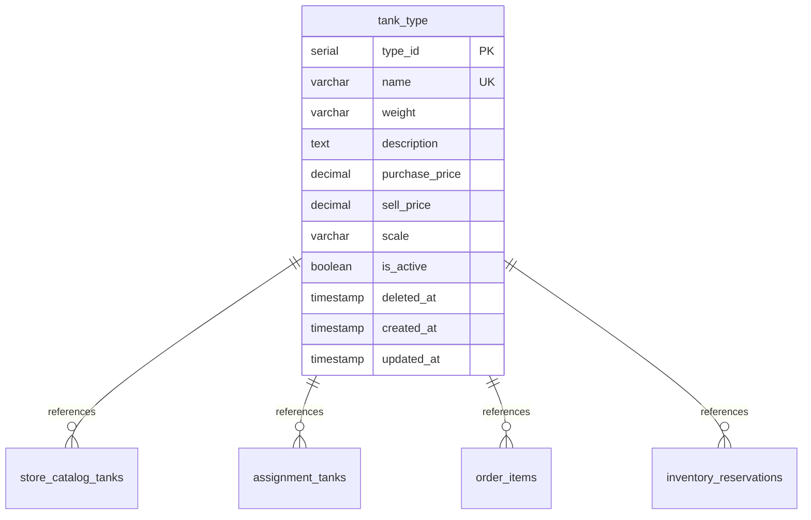
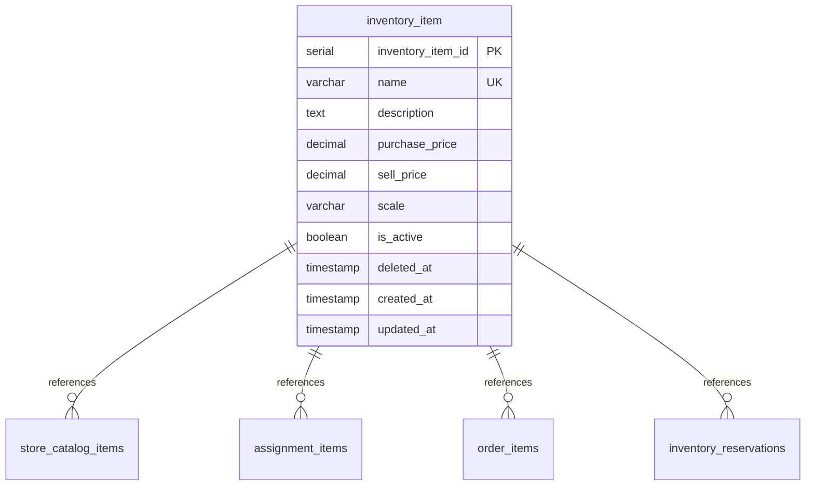

# Products Module - Database Schema Documentation

## Overview

The Products module utilizes two existing tables in the LPG delivery system database with enhancements for soft delete functionality. This document provides comprehensive schema information, relationships, and migration details.

## Database Technology

- **Database**: PostgreSQL 12+
- **ORM**: Drizzle ORM
- **Schema Management**: `npm run db:push` (no migration files)
- **Timezone**: UTC for system timestamps, GMT-5 for business operations

## Core Tables

### Tank Type Table (`tank_type`)

Stores information about different types of LPG tanks available in the system.

```sql
CREATE TABLE tank_type (
  type_id SERIAL PRIMARY KEY,
  name VARCHAR(50) NOT NULL UNIQUE,
  weight VARCHAR(5) NOT NULL,
  description TEXT,
  purchase_price DECIMAL(10,2) NOT NULL,
  sell_price DECIMAL(10,2) NOT NULL,
  scale VARCHAR(10) NOT NULL DEFAULT 'unidad',
  is_active BOOLEAN NOT NULL DEFAULT true,
  deleted_at TIMESTAMP NULL,
  created_at TIMESTAMP DEFAULT NOW(),
  updated_at TIMESTAMP DEFAULT NOW()
);
```

#### Column Definitions

| Column | Type | Constraints | Description |
|--------|------|-------------|-------------|
| `type_id` | SERIAL | PRIMARY KEY | Auto-incrementing unique identifier |
| `name` | VARCHAR(50) | NOT NULL, UNIQUE | Unique tank type name |
| `weight` | VARCHAR(5) | NOT NULL | Weight specification (e.g., "10kg", "5kg") |
| `description` | TEXT | NULLABLE | Optional detailed description |
| `purchase_price` | DECIMAL(10,2) | NOT NULL | Cost price for purchasing the tank |
| `sell_price` | DECIMAL(10,2) | NOT NULL | Selling price to customers |
| `scale` | VARCHAR(10) | NOT NULL, DEFAULT 'unidad' | Unit of measurement |
| `is_active` | BOOLEAN | NOT NULL, DEFAULT true | Soft delete flag |
| `deleted_at` | TIMESTAMP | NULLABLE | Soft delete timestamp |
| `created_at` | TIMESTAMP | DEFAULT NOW() | Record creation timestamp |
| `updated_at` | TIMESTAMP | DEFAULT NOW() | Last modification timestamp |

#### Business Rules

1. **Price Validation**: `sell_price` must be greater than `purchase_price`
2. **Unique Names**: Tank type names must be unique across active records
3. **Weight Format**: Typically follows pattern like "10kg", "5kg", "45kg"
4. **Soft Delete**: Records are marked inactive rather than physically deleted

#### Sample Data

```sql
INSERT INTO tank_type (name, weight, description, purchase_price, sell_price, scale) VALUES
('GLP Premium 10kg', '10kg', 'Tanque de gas premium de 10 kilogramos', 45000.00, 55000.00, 'unidad'),
('GLP Regular 10kg', '10kg', 'Tanque de gas regular de 10 kilogramos', 40000.00, 50000.00, 'unidad'),
('GLP Premium 5kg', '5kg', 'Tanque de gas premium de 5 kilogramos', 25000.00, 32000.00, 'unidad'),
('GLP Regular 5kg', '5kg', 'Tanque de gas regular de 5 kilogramos', 22000.00, 28000.00, 'unidad'),
('GLP Premium 45kg', '45kg', 'Tanque de gas premium de 45 kilogramos', 180000.00, 220000.00, 'unidad'),
('GLP Regular 45kg', '45kg', 'Tanque de gas regular de 45 kilogramos', 160000.00, 200000.00, 'unidad'),
('Cilindro Premium 20kg', '20kg', 'Cilindro premium de 20 kilogramos', 80000.00, 95000.00, 'unidad'),
('Cilindro Regular 20kg', '20kg', 'Cilindro regular de 20 kilogramos', 75000.00, 90000.00, 'unidad');
```

### Inventory Item Table (`inventory_item`)

Stores information about non-tank products like valves, adapters, and accessories.

```sql
CREATE TABLE inventory_item (
  inventory_item_id SERIAL PRIMARY KEY,
  name VARCHAR(100) NOT NULL UNIQUE,
  description TEXT,
  purchase_price DECIMAL(10,2) NOT NULL,
  sell_price DECIMAL(10,2) NOT NULL,
  scale VARCHAR(10) NOT NULL,
  is_active BOOLEAN NOT NULL DEFAULT true,
  deleted_at TIMESTAMP NULL,
  created_at TIMESTAMP DEFAULT NOW(),
  updated_at TIMESTAMP DEFAULT NOW()
);
```

#### Column Definitions

| Column | Type | Constraints | Description |
|--------|------|-------------|-------------|
| `inventory_item_id` | SERIAL | PRIMARY KEY | Auto-incrementing unique identifier |
| `name` | VARCHAR(100) | NOT NULL, UNIQUE | Unique item name |
| `description` | TEXT | NULLABLE | Optional detailed description |
| `purchase_price` | DECIMAL(10,2) | NOT NULL | Cost price for purchasing the item |
| `sell_price` | DECIMAL(10,2) | NOT NULL | Selling price to customers |
| `scale` | VARCHAR(10) | NOT NULL | Unit of measurement |
| `is_active` | BOOLEAN | NOT NULL, DEFAULT true | Soft delete flag |
| `deleted_at` | TIMESTAMP | NULLABLE | Soft delete timestamp |
| `created_at` | TIMESTAMP | DEFAULT NOW() | Record creation timestamp |
| `updated_at` | TIMESTAMP | DEFAULT NOW() | Last modification timestamp |

#### Business Rules

1. **Price Validation**: `sell_price` must be greater than `purchase_price`
2. **Unique Names**: Item names must be unique across active records
3. **Scale Required**: Scale/unit must be specified for all items
4. **Soft Delete**: Records are marked inactive rather than physically deleted

#### Sample Data

```sql
INSERT INTO inventory_item (name, description, purchase_price, sell_price, scale) VALUES
('Válvula Regular', 'Válvula estándar para tanques de gas', 15000.00, 25000.00, 'unidad'),
('Válvula Premium PB', 'Válvula premium para presión baja', 25000.00, 35000.00, 'unidad'),
('Válvula Premium PA', 'Válvula premium para presión alta', 30000.00, 40000.00, 'unidad'),
('Adaptador de presión alta', 'Adaptador para conexiones de alta presión', 8000.00, 12000.00, 'unidad'),
('Manguera alta presión', 'Manguera reforzada para alta presión', 35000.00, 45000.00, 'metro'),
('Manguera baja presión', 'Manguera estándar para baja presión', 20000.00, 30000.00, 'metro');
```

## Schema Enhancements

### Soft Delete Implementation

Both tables were enhanced with soft delete functionality through two new columns:

```sql
-- Added to both tank_type and inventory_item tables
ALTER TABLE tank_type ADD COLUMN is_active BOOLEAN NOT NULL DEFAULT true;
ALTER TABLE tank_type ADD COLUMN deleted_at TIMESTAMP NULL;

ALTER TABLE inventory_item ADD COLUMN is_active BOOLEAN NOT NULL DEFAULT true;
ALTER TABLE inventory_item ADD COLUMN deleted_at TIMESTAMP NULL;
```

#### Soft Delete Logic

1. **Active Records**: `is_active = true` AND `deleted_at IS NULL`
2. **Deleted Records**: `is_active = false` AND `deleted_at IS NOT NULL`
3. **Default Queries**: Filter by `is_active = true` unless explicitly including deleted records
4. **Restoration**: Set `is_active = true` AND `deleted_at = NULL`

## Indexes

### Performance Optimization Indexes

```sql
-- Tank type indexes
CREATE INDEX idx_tank_type_active ON tank_type(is_active) WHERE is_active = true;
CREATE INDEX idx_tank_type_name ON tank_type(name) WHERE is_active = true;
CREATE INDEX idx_tank_type_weight ON tank_type(weight) WHERE is_active = true;
CREATE INDEX idx_tank_type_price_range ON tank_type(sell_price) WHERE is_active = true;

-- Inventory item indexes
CREATE INDEX idx_inventory_item_active ON inventory_item(is_active) WHERE is_active = true;
CREATE INDEX idx_inventory_item_name ON inventory_item(name) WHERE is_active = true;
CREATE INDEX idx_inventory_item_price_range ON inventory_item(sell_price) WHERE is_active = true;

-- Search optimization
CREATE INDEX idx_tank_type_search ON tank_type USING gin(to_tsvector('spanish', name || ' ' || COALESCE(description, ''))) WHERE is_active = true;
CREATE INDEX idx_inventory_item_search ON inventory_item USING gin(to_tsvector('spanish', name || ' ' || COALESCE(description, ''))) WHERE is_active = true;
```

### Index Benefits

- **Partial Indexes**: Only index active records for better performance
- **Search Optimization**: Full-text search indexes for name and description
- **Price Range Queries**: Optimized filtering by price ranges
- **Unique Name Enforcement**: Ensures name uniqueness among active records

## Relationships

### Tank Type Relationships



### Inventory Item Relationships



### Relationship Details

#### Store Catalog Integration
- `store_catalog_tanks` → `tank_type.type_id`
- `store_catalog_items` → `inventory_item.inventory_item_id`
- **Purpose**: Store-specific product availability and pricing

#### Inventory Management Integration
- `assignment_tanks` → `tank_type.type_id`
- `assignment_items` → `inventory_item.inventory_item_id`
- **Purpose**: Daily inventory assignments and tracking

#### Orders System Integration
- `order_items` → `tank_type.type_id` OR `inventory_item.inventory_item_id`
- `inventory_reservations` → `tank_type.type_id` OR `inventory_item.inventory_item_id`
- **Purpose**: Order processing and inventory reservation

## Constraints and Triggers

### Check Constraints

```sql
-- Price validation constraints
ALTER TABLE tank_type ADD CONSTRAINT chk_tank_type_price_valid 
    CHECK (sell_price > purchase_price);

ALTER TABLE inventory_item ADD CONSTRAINT chk_inventory_item_price_valid 
    CHECK (sell_price > purchase_price);

-- Soft delete consistency constraints
ALTER TABLE tank_type ADD CONSTRAINT chk_tank_type_soft_delete 
    CHECK ((is_active = true AND deleted_at IS NULL) OR (is_active = false AND deleted_at IS NOT NULL));

ALTER TABLE inventory_item ADD CONSTRAINT chk_inventory_item_soft_delete 
    CHECK ((is_active = true AND deleted_at IS NULL) OR (is_active = false AND deleted_at IS NOT NULL));
```

### Update Triggers

```sql
-- Automatic updated_at timestamp triggers
CREATE OR REPLACE FUNCTION update_updated_at_column()
RETURNS TRIGGER AS $$
BEGIN
    NEW.updated_at = NOW();
    RETURN NEW;
END;
$$ language 'plpgsql';

CREATE TRIGGER update_tank_type_updated_at 
    BEFORE UPDATE ON tank_type 
    FOR EACH ROW EXECUTE FUNCTION update_updated_at_column();

CREATE TRIGGER update_inventory_item_updated_at 
    BEFORE UPDATE ON inventory_item 
    FOR EACH ROW EXECUTE FUNCTION update_updated_at_column();
```

## Data Migration

### Schema Migration Commands

```bash
# Apply schema changes (Drizzle ORM)
npm run db:push

# Create indexes (manual execution)
psql -d lpg_database -f scripts/create_product_indexes.sql

# Verify schema
npm run db:introspect
```

### Migration Script Example

```sql
-- Migration script: add_soft_delete_to_products.sql
BEGIN;

-- Add soft delete columns to tank_type
ALTER TABLE tank_type 
    ADD COLUMN IF NOT EXISTS is_active BOOLEAN NOT NULL DEFAULT true,
    ADD COLUMN IF NOT EXISTS deleted_at TIMESTAMP NULL;

-- Add soft delete columns to inventory_item
ALTER TABLE inventory_item 
    ADD COLUMN IF NOT EXISTS is_active BOOLEAN NOT NULL DEFAULT true,
    ADD COLUMN IF NOT EXISTS deleted_at TIMESTAMP NULL;

-- Create indexes
CREATE INDEX CONCURRENTLY IF NOT EXISTS idx_tank_type_active 
    ON tank_type(is_active) WHERE is_active = true;

CREATE INDEX CONCURRENTLY IF NOT EXISTS idx_inventory_item_active 
    ON inventory_item(is_active) WHERE is_active = true;

-- Add constraints
ALTER TABLE tank_type 
    ADD CONSTRAINT IF NOT EXISTS chk_tank_type_price_valid 
    CHECK (sell_price > purchase_price);

ALTER TABLE inventory_item 
    ADD CONSTRAINT IF NOT EXISTS chk_inventory_item_price_valid 
    CHECK (sell_price > purchase_price);

COMMIT;
```

## Query Patterns

### Common Query Examples

#### List Active Products with Pagination

```sql
-- Active tank types with pagination
SELECT type_id, name, weight, purchase_price, sell_price
FROM tank_type 
WHERE is_active = true 
ORDER BY created_at DESC 
LIMIT 50 OFFSET 0;

-- Active inventory items with search
SELECT inventory_item_id, name, description, sell_price
FROM inventory_item 
WHERE is_active = true 
  AND (name ILIKE '%válvula%' OR description ILIKE '%válvula%')
ORDER BY name;
```

#### Price Range Filtering

```sql
-- Tank types in price range
SELECT name, weight, sell_price
FROM tank_type 
WHERE is_active = true 
  AND sell_price BETWEEN 40000 AND 60000
ORDER BY sell_price;
```

#### Soft Delete Operations

```sql
-- Soft delete a tank type
UPDATE tank_type 
SET is_active = false, deleted_at = NOW(), updated_at = NOW()
WHERE type_id = 1;

-- Restore a tank type
UPDATE tank_type 
SET is_active = true, deleted_at = NULL, updated_at = NOW()
WHERE type_id = 1;

-- List deleted products
SELECT name, deleted_at 
FROM tank_type 
WHERE is_active = false 
ORDER BY deleted_at DESC;
```

#### Reference Checking Queries

```sql
-- Check if tank type is referenced in orders
SELECT COUNT(*) as order_references
FROM order_items oi
WHERE oi.tank_type_id = 1;

-- Check if item is referenced in current inventory
SELECT COUNT(*) as inventory_references
FROM assignment_items ai
JOIN inventory_assignments ia ON ai.inventory_id = ia.inventory_id
WHERE ai.inventory_item_id = 1 
  AND ia.status != 'CONSOLIDATED';
```

## Data Integrity

### Referential Integrity Rules

1. **Cascade Behavior**: No cascading deletes - soft delete prevents data loss
2. **Reference Checking**: Products cannot be deleted if referenced in:
   - Active orders (`order_items`)
   - Current inventory (`assignment_tanks`, `assignment_items`)
   - Pending reservations (`inventory_reservations`)

### Data Validation Rules

1. **Price Rules**: Sell price > Purchase price (enforced at database and application level)
2. **Name Uniqueness**: Unique among active records only
3. **Required Fields**: All non-nullable fields must be provided
4. **Soft Delete Consistency**: `is_active` and `deleted_at` must be consistent

### Backup and Recovery

```sql
-- Backup products data
pg_dump -t tank_type -t inventory_item lpg_database > products_backup.sql

-- Restore from backup
psql lpg_database < products_backup.sql
```

## Performance Considerations

### Query Optimization

1. **Index Usage**: Ensure queries use appropriate indexes
2. **Partial Indexes**: Leverage partial indexes for active records
3. **Query Plans**: Monitor execution plans for complex queries
4. **Connection Pooling**: Use connection pooling for high-traffic scenarios

### Monitoring Queries

```sql
-- Monitor slow queries
SELECT query, mean_exec_time, calls
FROM pg_stat_statements
WHERE query LIKE '%tank_type%' OR query LIKE '%inventory_item%'
ORDER BY mean_exec_time DESC;

-- Check index usage
SELECT schemaname, tablename, indexname, idx_scan, idx_tup_read
FROM pg_stat_user_indexes
WHERE tablename IN ('tank_type', 'inventory_item');
```

This comprehensive schema documentation provides all necessary information for understanding, maintaining, and extending the Products module database structure.